# Payfinia — Money Movement Analytics & Migration ROI

**Quantifying the financial return for a community financial institution (CFI) of migrating
transaction volume from legacy rails (checks, wires, Same-Day ACH) to instant payment
rails (FedNow & RTP) — and identifying which institutions to target first.**

> USF FinTech Graduate Project for Payfinia. Built entirely on publicly available data,
> designed to be calibrated against Payfinia production data in a downstream phase.

---

## Table of contents
1. [What this project delivers](#1-what-this-project-delivers)
2. [Architecture](#2-architecture)
3. [Quick start](#3-quick-start)
4. [Repository structure](#4-repository-structure)
5. [Component guide (how to run each piece)](#5-component-guide)
6. [Key findings](#6-key-findings)
7. [Data sources & research integrity](#7-data-sources--research-integrity)
8. [Reproduce everything end-to-end](#8-reproduce-everything-end-to-end)
9. [Tech stack](#9-tech-stack)
10. [Disclaimer & calibration](#10-disclaimer--calibration)

---

## 1. What this project delivers

The project answers one question a CFI asks about instant payments —
*"If I move volume off checks and wires onto FedNow/RTP, what is the return?"* — and turns it
into decision-ready tools, mapped to the four deliverables in the project brief:

| # | Deliverable | What it is | Folder |
|---|-------------|------------|--------|
| 1 | **Public Data Synthesis** | Sourced reference base of rail volumes, costs, fraud & global adoption | `data-synthesis/` |
| 2 | **Migration ROI Model** | 3-layer full-cost model (Python + live Excel) quantifying migration savings | `roi-model/` |
| 3 | **CFI Archetype Analysis** | Unsupervised ML (K-means + PCA) grouping banks into types mapped to ROI ranges | `archetype-analysis/` |
| 4 | **Interactive ROI Calculator** | Client-facing guided web app + Streamlit twin | `web-calculator/`, `roi-calculator-streamlit/` |
| + | **Prospect Finder** *(go-to-market extension)* | Ranks all ~4,089 U.S. community banks into target segments, with outreach templates | `prospect-finder/` |
| + | **Data-story Dashboard** | The "why instant payments win" narrative for stakeholders | `dashboard/` |

Every figure is sourced. Numbers that cannot be directly cited are labelled **Estimate** and
flagged as calibration targets — nothing is fabricated.

---

## 2. Architecture

The whole system is one pipeline: public data goes in one end, and two client-facing
decision tools come out the other — a **savings calculator** for a specific CFI, and a
**prospect list** ranking all CFIs worth calling.

```mermaid
flowchart TD
    subgraph SRC["Public data sources"]
        FED["Federal Reserve<br/>FedNow · Fedwire · Payments Study"]
        NACHA["Nacha (ACH)"]
        TCH["The Clearing House (RTP)"]
        AFP["AFP Fraud &amp; Control Survey"]
        FDIC["FDIC BankFind API<br/>~4,089 community banks"]
    end

    subgraph D1["1 · Data Synthesis"]
        SYN["Sourced workbook + written synthesis<br/>rail volumes, costs, fraud, global adoption"]
    end

    subgraph D2["2 · ROI Model (canonical engine)"]
        ROI["roi_model.py + live Excel twin<br/>3 cost layers: network · provider · FI-internal<br/>&#8594; savings/txn &#8594; ROI, payback, 5-yr NPV"]
        UNIT["rail_unit_economics/<br/>per-rail cost-stack PDFs"]
    end

    subgraph D3["3 · CFI Archetype Analysis"]
        FETCH["fetch_payfinia_banks.py<br/>pulls full bank universe"]
        CLUSTER["archetype_analysis.py<br/>K-means (silhouette 0.39) + PCA"]
    end

    subgraph D4["4 · Client-facing calculators"]
        WEB["web-calculator (React/Vite)<br/>Wizard &#8594; Client Result &#8594; Advanced view<br/>(Cost Builder, overrides, Compare, Why-Migrate)"]
        ST["roi-calculator-streamlit (Streamlit twin)"]
        DASH["dashboard (Streamlit data story)"]
    end

    subgraph D5["Prospect Finder (go-to-market)"]
        PSCORE["scoring.py + cluster_prospects.py<br/>Segments A&#8594;D by $ opportunity"]
        PFILTER["filter_network_participants.py<br/>drop existing FedNow/RTP participants"]
        PWEB["prospect-finder/web (React)"]
        PST["prospect_finder_app.py (Streamlit)"]
        PEMAIL["PROSPECT_EMAIL_TEMPLATES.md<br/>segment-tailored outreach"]
    end

    FED --> SYN
    NACHA --> SYN
    TCH --> SYN
    AFP --> SYN
    SYN --> ROI
    UNIT --> ROI

    FDIC --> FETCH
    FETCH --> CLUSTER
    CLUSTER --> ROI

    ROI --> WEB
    ROI --> ST
    ROI --> DASH

    CLUSTER --> PSCORE
    PSCORE --> PFILTER
    PFILTER --> PWEB
    PFILTER --> PST
    PWEB --> PEMAIL
    PST --> PEMAIL

    WEB -. "npm run build" .-> VERCEL["Vercel<br/>(static hosting)"]
    PWEB -. "npm run build" .-> VERCEL
```



**Read it as three stages:**
1. **Ingest & synthesize** — public regulator/industry stats and the live FDIC API feed a
   sourced data layer (`data-synthesis/`) and the full bank universe (`prospect-finder/fetch_payfinia_banks.py`).
2. **Model** — the ROI engine (`roi-model/roi_model.py`) is the single source of truth for
   cost math; the archetype pipeline (`archetype-analysis/`) clusters banks so the model's
   assumptions can be applied *per segment*, not just per example CFI.
3. **Deliver** — the same ROI logic surfaces in two directions: a **calculator** a specific bank
   can self-serve (guided wizard → client result → advanced view), and a **prospect list** the
   Payfinia go-to-market team uses to decide who to call first, with ready-to-send email copy.

---

## 3. Quick start

**Prerequisites:** Python 3.9+ and (for the web apps) Node.js 18+.

```bash
# clone
git clone https://github.com/darrsshill/Payfinia-roi-analytics-.git
cd Payfinia-roi-analytics-

# --- Interactive ROI calculator (React, primary client tool) ---
cd web-calculator && npm install && npm run dev        # http://localhost:5173

# --- ROI calculator (Streamlit twin) ---
cd roi-calculator-streamlit && pip install -r requirements.txt && streamlit run roi_calculator.py

# --- Prospect Finder: pull all banks, segment, run ---
cd prospect-finder && pip install -r requirements.txt
python fetch_payfinia_banks.py      # pulls ~4,089 banks from the FDIC API
python cluster_prospects.py         # K-means segments + refreshes web data
streamlit run prospect_finder_app.py

# --- ROI model (prints results for 3 example CFIs) ---
python roi-model/roi_model.py

# --- CFI archetype analysis (ML + charts) ---
cd archetype-analysis && pip install -r requirements.txt && python archetype_analysis.py
```

---

## 4. Repository structure

```
Payfinia-ROI-Analytics/
├── README.md                       ← you are here
├── docs/
│   └── PROJECT_STATUS.md           ← current status & remaining work
├── requirements.txt                ← Python deps (analysis + Streamlit apps)
├── .gitignore
│
├── data-synthesis/                 # Deliverable 1 — the sourced data base
│   ├── Payfinia_Deliverable1_Public_Data_Synthesis.xlsx   (rail volumes, costs, fraud, global adoption; quality-rated)
│   └── Payfinia_Deliverable1_Public_Data_Synthesis.docx   (written synthesis + data-quality assessment)
│
├── roi-model/                      # Deliverable 2 — the migration ROI model
│   ├── roi_model.py                                       (documented Python model — canonical logic)
│   ├── Payfinia_Deliverable2_Migration_ROI_Model.xlsx      (live Excel model; edit inputs, results recalc)
│   └── rail_unit_economics/                                (one PDF per rail: 8-component cost stack)
│
├── roi-calculator-streamlit/       # Deliverable 4 — Streamlit calculator twin
│   ├── roi_calculator.py · requirements.txt
│
├── dashboard/                      # Data-story dashboard (the "why")
│   ├── app.py · requirements.txt · HOW_TO_RUN_DASHBOARD.md
│
├── web-calculator/                 # Deliverable 4 — React (Vite) calculator, primary client app
│   ├── src/
│   │   ├── Wizard.jsx              (guided 4-question intake)
│   │   ├── ClientResult.jsx        (one-screen client-facing results view)
│   │   ├── Compare.jsx             (side-by-side saved-scenario comparison)
│   │   ├── WhyMigrate.jsx          (per-rail Migrate/Consider/Keep explainer)
│   │   ├── ChatAssistant.jsx       (guided savings assistant)
│   │   ├── scenarios.js            (scenario save/compare state)
│   │   └── App.jsx · data.js · styles.css
│   ├── USER_GUIDE.md               (first-time user walkthrough)
│   ├── DATABASE_SETUP.md           (persistence design, in progress)
│   └── package.json · vercel.json
│
├── archetype-analysis/             # Deliverable 3 — unsupervised ML (K-means)
│   ├── archetype_analysis.py · data/fdic_cfi_sample.csv · outputs/ (charts + summary)
│
└── prospect-finder/                # Prospect ranking — all ~4,089 banks segmented
    ├── fetch_payfinia_banks.py     (FDIC API loader)
    ├── scoring.py                  (priority-score logic)
    ├── cluster_prospects.py        (K-means target segments A→D)
    ├── filter_network_participants.py  (excludes existing FedNow/RTP participants)
    ├── prospect_finder_app.py      (Streamlit)
    ├── PROSPECT_EMAIL_TEMPLATES.md (segment-tailored outreach copy)
    ├── README_APPROACH.md          (methodology write-up)
    ├── data/payfinia_bank_prospects.csv
    └── web/                        (React finder — deploy to Vercel)
```

---

## 5. Component guide

### 1 · Data Synthesis (`data-synthesis/`)
The reference base every model input traces back to. Open the `.xlsx` — six tabs cover rail
volumes/value, per-transaction costs, fraud & operational benchmarks, international
substitution (Pix, UK FPS), and a full sources + data-quality methodology. The `.docx` is the
written version for a non-technical reviewer. No code to run.

### 2 · ROI Model (`roi-model/`)
The engine. Each rail's cost is built from **8 components**, grouped into **3 layers** —
network fee · provider (Payfinia/TPSP) fee · FI internal cost (staff, failures, fraud,
compliance, reconciliation, liquidity). The model applies a substitution rate, computes savings
per migrated transaction, and rolls up to net benefit, ROI, payback, and 5-year NPV.
- `python roi_model.py` prints results for Small / Mid / Large example CFIs.
- The `.xlsx` is the same logic with live formulas (blue = inputs) so it recalculates as you edit.
- `rail_unit_economics/` has a one-page cost breakdown PDF for each rail.

### 3 · Interactive Calculator — Streamlit (`roi-calculator-streamlit/`)
The same underlying model in Streamlit, for quick analyst-side use. `streamlit run roi_calculator.py`.

### 4 · Data-story Dashboard (`dashboard/`)
The visual argument for instant payments (volumes, cost gap, momentum, fraud, international).
`streamlit run app.py`.

### 5 · Interactive Calculator — React (`web-calculator/`) *(primary, deployable)*
The client-facing tool, now a guided end-to-end flow:
- **Wizard** — a short, TurboTax-style intake (name, size, checks/wires per year, migration %).
- **Client Result** — one screen with the headline savings number, ROI, payback, and where the
  savings come from; inputs are editable inline and progress autosaves in the browser.
- **Advanced view** — the full toolkit: 3-layer cost model, **Cost Builder** mini-calculators
  that derive per-item costs from figures a bank actually has, an **"apply to all"** shortcut,
  **per-rail cost overrides** (type a known all-in $/txn and bypass the component build-up),
  "Use My Financials" top-down mode, a sanity check vs. call-report totals, and
  monthly/annual toggle.
- **Compare Versions** — save multiple scenarios (e.g. conservative vs. aggressive) and view
  them side by side with a chart.
- **Why Migrate** — an honest per-rail Migrate/Consider/Keep verdict (standard ACH is flagged
  "keep" — it's already cheaper than instant).
- A guided **Savings Assistant** chat ties it together.

`npm install && npm run dev`. **Deploy to Vercel:** set Root Directory to `web-calculator`,
framework Vite. See `USER_GUIDE.md` for the full walkthrough and `DATABASE_SETUP.md` for the
in-progress persistence design.

### 6 · CFI Archetype Analysis (`archetype-analysis/`)
The unsupervised ML piece. `python archetype_analysis.py` pulls FDIC data, engineers features,
runs K-means (k chosen with silhouette + elbow), visualizes clusters with PCA, and maps each
archetype to an expected ROI range. Outputs charts + `archetype_roi_summary.csv`.

### 7 · Prospect Finder (`prospect-finder/`)
Turns the analysis into a "call these first" tool across **all ~4,089** community banks.
- `fetch_payfinia_banks.py` — pulls the full universe from the FDIC API (with names).
- `cluster_prospects.py` — K-means into four target **segments (A→D)** and refreshes web data.
- `filter_network_participants.py` — cross-references FedNow/RTP published participant lists
  and strips banks that are already on a network, so outreach targets non-participants.
- `prospect_finder_app.py` (Streamlit) and `web/` (React) — filter by segment/state, ranked
  list, CSV export.
- `PROSPECT_EMAIL_TEMPLATES.md` — outreach copy keyed to each segment, merge-ready off the
  prospect CSV columns.

---

## 6. Key findings

**The migration case (ROI model):** savings come from displacing **checks (~$3/txn)** and
**wires (~$19/txn)** — an instant payment costs ~$0.77–0.87 all-in. Standard ACH is already
cheaper than instant, so migrating it does not pay. A mid-size (~$1B) CFI nets roughly
**$300K/year** with payback in months.

**Who to target (Prospect Finder, K-means on 4,089 banks, silhouette 0.39):**

| Segment | Banks | Total opportunity / yr | Avg ROI |
|---------|-------|------------------------|---------|
| **A — Target first** | 439 | **$551M** | 359% |
| B — Strong | 1,128 | $394M | 200% |
| C — Moderate | 1,574 | $159M | 116% |
| D — Low priority | 948 | $20M | 53% |

**Takeaway:** prioritize Segment A (large/regional banks) — highest value *and* highest ROI.

---

## 7. Data sources & research integrity

All figures are public and cited. Primary sources:
Federal Reserve (Payments Study, FedNow stats, Fedwire stats, Regulation II) · Nacha (ACH) ·
The Clearing House (RTP) · AFP Payments Fraud & Control Survey · FFIEC · FDIC BankFind API ·
Banco Central do Brasil (Pix) · Pay.UK. Full source lists with links are on the "Sources" tabs
of the workbooks and inside the apps.

**Integrity rule applied throughout:** real, verifiable figures only. Cost lines that are not
directly citable (per-item processing, fraud prevention, compliance, reconciliation, liquidity;
and each bank's exact rail mix) are labelled **Estimate** — grounded in benchmark midpoints and
flagged as the numbers to calibrate with Payfinia production data. Nothing is fabricated.

---

## 8. Reproduce everything end-to-end

```bash
# 1. ROI model results
python roi-model/roi_model.py

# 2. Archetype analysis (ML + charts)
cd archetype-analysis && pip install -r requirements.txt && python archetype_analysis.py && cd ..

# 3. Prospect universe + segmentation
cd prospect-finder && pip install -r requirements.txt
python fetch_payfinia_banks.py            # live FDIC pull (~4,089 banks)
python cluster_prospects.py               # K-means segments + writes web/src/prospects.json
python filter_network_participants.py     # (optional) drop existing FedNow/RTP participants
cd ..

# 4. Run the client tools
cd web-calculator && npm install && npm run dev        # calculator
# (new terminal)
cd prospect-finder/web && npm install && npm run dev   # prospect finder
```

---

## 9. Tech stack

**Analysis / models:** Python · pandas · NumPy · scikit-learn (K-means, PCA, StandardScaler) ·
matplotlib · openpyxl.
**Apps:** Streamlit + Plotly (internal) · React + Vite + Recharts (client-facing, Vercel-deployable).
**Data:** FDIC BankFind public API + published regulator/industry statistics.

---

## 10. Disclaimer & calibration

These tools produce **analytical estimates, not guarantees of savings**. Bank characteristics
(assets, deposits, offices, income) are real FDIC data; per-transaction economics use
conservative public-benchmark midpoints. The model is built so Payfinia can calibrate it
against internal production data — fraud loss per item, true processing cost per item, real
substitution rates, and actual rail mix — without re-architecting anything.

*USF FinTech Graduate Project · Prepared for Payfinia · 2025–2026.*
